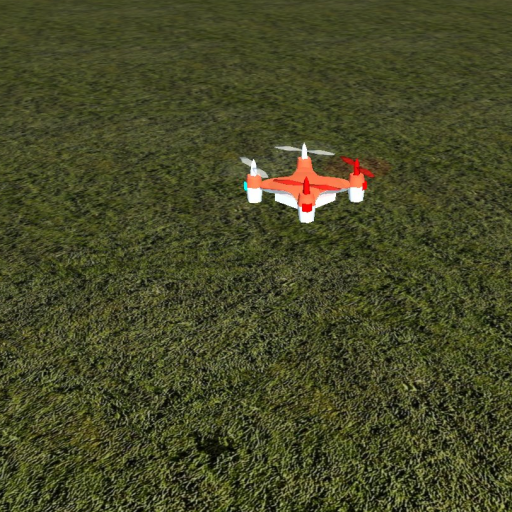

# Nano Quad Simulator

## What is it?

A simple flight simulator, simulates something that kinda looks like, and somewhat behaves like a CX-10 nano quadcopter.

I saw a professional RC simulator once, which was cool, but it didn't have any nano quads.. so I made my own.. flight simulator.. of a nano quad.

## Why?

I wanted something to learn how not to get disoriented when the quad is not facing away from me (the easiest way to fly for beginners), without the risk of crashing into a wall or losing it in the tall grass. (The CX-10 ir really tiny, the motors are only 3.2 cm apart)

## How?

It is built on the jMonkey3 game engine. 

It requires a gamepad to play (needs two analog sticks for 4 channels). While jMonkey does handle joystick inputs, I wrote my own handling of the gamepad using jinput, because I didn't like how it's handled by jMonkey. Or didn't know how to use it properly.

So far I've tried only with a Logitech F310 on Windows. If you have a gamepad and want to help me, do this: build the project and then run:

``
java -cp {{built jar file}} junk.ReadAllEvents
``

Wiggle all the axes, push all the buttons, then send me the output and tell me what you did.

## What do I need?

A graphics card with hardware OpenGL (for jMonkey), a gamepad, Java.

## So this is it?

Yes. No. Maybe. I don't know. I might add more features or improve something as I go along.
